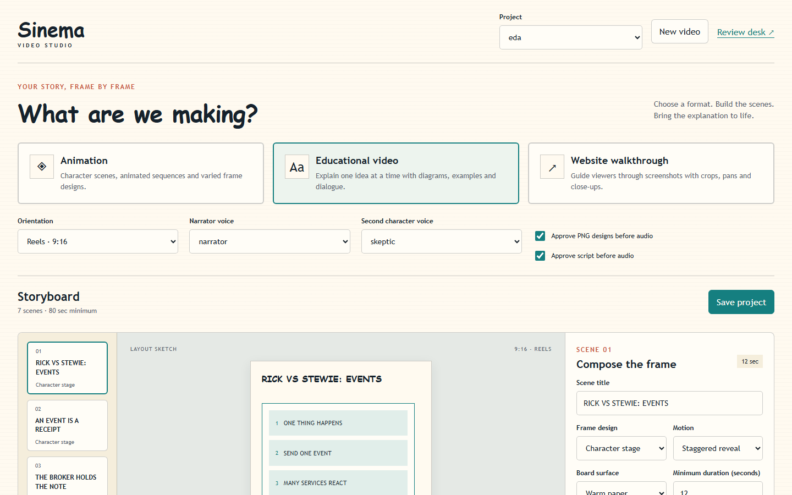
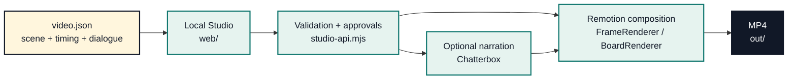

<div align="center">

# Sinema

### Storyboard → review → narration → Remotion render

Build educational explainers and product walkthroughs from small, version-controlled video specs — then ship a polished MP4 from a local browser studio.

<p>
  <a href="#watch-the-examples">Watch the examples</a> ·
  <a href="#quick-start">Quick start</a> ·
  <a href="#how-it-fits-together">Architecture</a>
</p>


</div>

<br />

> Sinema is a local-first video studio for turning structured stories into reviewed, narrated Remotion renders. The source of truth is a small `videos/<id>/video.json` file — not a database, timeline, or hosted service.

## Watch the examples

The examples below are checked-in renders, so they work offline and stay next to the specs that produced them.

<table>
  <tr>
    <td width="50%" valign="top">
      <h3>EDA · Event-driven architecture</h3>
      <p>Explains events, brokers, async work, retries, and trade-offs through a compact 9:16 educational story.</p>
      <video controls preload="metadata" width="100%" src="./out/eda-reels.mp4">
        Your browser cannot play this video. <a href="./out/eda-reels.mp4">Download the EDA example</a>.
      </video>
      <p><a href="./out/eda-reels.mp4">Open the EDA render ↗</a> · <a href="./videos/eda/video.json"><code>videos/eda/video.json</code></a></p>
    </td>
    <td width="50%" valign="top">
      <h3>MindKraft · Product walkthrough</h3>
      <p>Uses browser-style frames to tell the story of a clearer job-search workflow, from problem to next step.</p>
      <video controls preload="metadata" width="100%" src="./out/mindkraft-explainer-reels.mp4">
        Your browser cannot play this video. <a href="./out/mindkraft-explainer-reels.mp4">Download the MindKraft example</a>.
      </video>
      <p><a href="./out/mindkraft-explainer-reels.mp4">Open the MindKraft render ↗</a> · <a href="./videos/mindkraft-explainer/video.json"><code>videos/mindkraft-explainer/video.json</code></a></p>
    </td>
  </tr>
</table>

## What makes it useful

| 01 · Write the story | 02 · Review the frames | 03 · Render the result |
| --- | --- | --- |
| Describe scenes, dialogue, beats, layout, motion, and assets in JSON. | Open the local Studio, inspect the visual set, listen to narration, and approve the handoff. | Validate the spec and render a reproducible MP4 with Remotion. |

The workflow is deliberately file-backed. A project can be copied, diffed, reviewed in Git, or edited with another tool without exporting from a proprietary editor.

## The Studio in the browser

The local web app is a dependency-light production desk for choosing a format, composing scenes, checking approvals, and handing a project to the renderer.

<p align="center">
  
</p>

<p align="center"><em>Sinema Studio — the EDA project loaded in the local browser workspace.</em></p>

## How it fits together



### The important boundary

`videos/<id>/video.json` is the intermediate representation. It carries the story and timing contract; the Studio edits and validates it; the renderer turns it into frames and then an MP4.

```text
video.json
   |
   +-- web/                     local review + editing UI
   +-- scripts/validate-video   schema, assets, timing, approval checks
   +-- public/ + assets/        registered visual and audio inputs
   +-- src/                     React + Remotion compositions
                                  +-- out/<name>.mp4
```

## Tech stack

| Layer | Tools | Why it is here |
| --- | --- | --- |
| Studio UI | HTML, CSS, vanilla JavaScript | A small local browser surface with no UI framework dependency. |
| Video composition | React 19, TypeScript 5, Remotion 4 | Describe scenes as components and render every frame deterministically. |
| Motion + media | GSAP, `@remotion/media`, `@remotion/captions` | Timelines, media playback, and caption-ready composition primitives. |
| Render pipeline | Remotion CLI, `ffmpeg-static`, `ffprobe-static` | Produce MP4s and inspect media locally. |
| Optional voice | Chatterbox, Python, PyTorch | Generate local narration when a project does not already have audio. |
| Browser capture | Playwright | Capture walkthrough screens and verify the local Studio when needed. |

## Quick start

Requires Node.js 20+ and the checked-in npm lockfile.

```powershell
npm install
npm run typecheck
npm run validate:video -- eda
npm run web
```

Open <http://127.0.0.1:4173> to use the local Studio. To open the Remotion authoring studio instead:

```powershell
npm run dev
```

Render a project after its assets and approvals are ready:

```powershell
npm run render:video -- eda
```

The result is written to `out/`.

## Create a project

1. Add or edit a project spec at `videos/<id>/video.json`.
2. Define its scenes: narration, beats, layout, motion, dialogue, and visual inputs.
3. Run validation and open the Studio for a visual review.
4. Approve the assets and script, then generate narration if needed.
5. Render the final MP4.

Useful commands:

```powershell
npm run validate:video -- <project-id>
npm run test:studio
npm run assets:scan
npm run render:video -- <project-id>
```

## Repository map

```text
videos/             project specs and review state
web/                local Studio and review-desk browser client
src/                React components, compositions, and data contracts
scripts/            validation, capture, audio, asset, and render commands
public/assets/      registered visual assets used by compositions
brand/              shared style tokens and board definitions
out/                generated example videos and render output
```

## Notes on narration and licensing

Narration is optional. The Studio and renderer work without Chatterbox when a project already has audio or is rendered without audio. If you use the optional Python path, follow the current setup and model instructions from the official [Chatterbox repository](https://github.com/resemble-ai/chatterbox).

Original Sinema source code is released under the MIT License — see [`LICENSE`](./LICENSE). That license does not relicense bundled media, logos, model checkpoints, or dependencies. Review [`THIRD_PARTY_NOTICES.md`](./THIRD_PARTY_NOTICES.md), [`assets/open-source.json`](./assets/open-source.json), and each asset manifest before redistributing a render.

Remotion, GSAP, FFmpeg, Chatterbox, PyTorch, and their related assets have separate license and redistribution terms. Check those terms before using Sinema commercially.

<div align="center">

<sub>Local-first video production for explainers, walkthroughs, and the stories in between.</sub>

</div>
